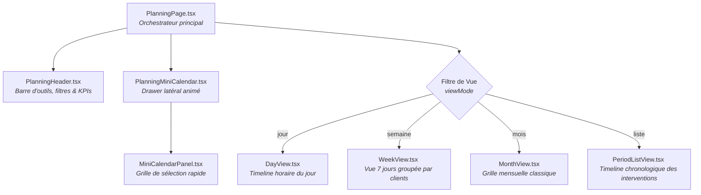

# Labocea PMC V2 — Cours de code depuis zéro

## Prérequis : tu ne dois rien savoir avant de commencer

---

# SECTION 0 — JavaScript moderne : les bases indispensables

Avant de toucher à React, il faut comprendre quelques outils JavaScript qui apparaissent partout dans le code.

## 0.1 Les fonctions fléchées (arrow functions)

```ts
// Fonction classique
function double(x) {
  return x * 2
}

// Fonction fléchée — exactement pareil, écriture plus courte
const double = (x) => x * 2

// Avec plusieurs instructions :
const describe = (client) => {
  const label = client.nom + ' (' + client.segment + ')'
  return label
}
```

Les fonctions fléchées sont utilisées partout dans les callbacks et les composants React.

**Question :** Réécris cette fonction en fléchée :
```js
function saluer(prenom) {
  return "Bonjour " + prenom
}
```

<details>
<summary>Réponse</summary>

```js
const saluer = (prenom) => "Bonjour " + prenom
```
</details>

## 0.2 Async/await et les Promesses

Quand tu lis ou écris dans Firestore, l'opération prend du temps (réseau). JavaScript gère ça avec des **Promesses** — un objet qui dit "je te donnerai le résultat plus tard".

```ts
// Sans async/await — difficile à lire
getDoc(docRef).then((snap) => {
  const data = snap.data()
  console.log(data)
})

// Avec async/await — beaucoup plus lisible
async function chargerClient(clientId) {
  const snap = await getDoc(doc(db, 'clients-v2', clientId))
  const data = snap.data()
  console.log(data)
}
```

`await` = "attends que cette opération soit terminée avant de continuer".
`async` = obligatoire devant toute fonction qui contient un `await`.

```ts
// Exemple complet — sauvegarder un client
async function sauvegarder(client) {
  await setDoc(doc(db, 'clients-v2', client.id), client)
  console.log('Sauvegardé !')     // s'affiche APRÈS la sauvegarde
}
```

**Question :** Que se passe-t-il si tu oublies le `await` devant `setDoc` ?

<details>
<summary>Réponse</summary>

La ligne suivante s'exécute immédiatement, sans attendre que la sauvegarde soit terminée. Le `console.log('Sauvegardé !')` s'afficherait avant que Firestore ait réellement écrit les données. Dans le pire cas, l'app se comporte de façon imprévisible (on navigue vers une autre page avant que les données soient écrites).
</details>

## 0.3 Les méthodes de tableau (.map, .filter, .find)

Ces trois méthodes sont dans **chaque composant** qui affiche une liste. Elles sont indispensables.

### .map() — transformer chaque élément

```ts
const clients = ['Plounerin', 'Kerdrein', 'Brest']

// Produit un nouveau tableau en transformant chaque élément
const labels = clients.map((nom) => nom.toUpperCase())
// → ['PLOUNERIN', 'KERDREIN', 'BREST']
```

En JSX, `.map()` génère une liste de composants :

```tsx
function ListeClients({ clients }) {
  return (
    <div>
      {clients.map((client) => (
        <ClientCard key={client.id} client={client} />
      ))}
    </div>
  )
}
```

### .filter() — garder seulement certains éléments

```ts
const equipements = [
  { nom: 'YSI Pro30', etat: 'operationnel' },
  { nom: 'Turbidi', etat: 'en_maintenance' },
  { nom: 'pH-mètre', etat: 'operationnel' },
]

// Garde seulement ceux dont l'état est 'operationnel'
const opérationnels = equipements.filter((e) => e.etat === 'operationnel')
// → [{ nom: 'YSI Pro30', ... }, { nom: 'pH-mètre', ... }]
```

### .find() — trouver UN élément

```ts
// Retourne le premier qui correspond, ou undefined si aucun
const client = clients.find((c) => c.id === 'abc123')
```

**Question :** Tu as un tableau `maintenances` et tu veux garder seulement celles dont le `statut` est `'planifiee'`. Quelle ligne ?

<details>
<summary>Réponse</summary>

```ts
const planifiees = maintenances.filter((m) => m.statut === 'planifiee')
```
</details>

## 0.4 La déstructuration (destructuring)

Extraire des propriétés d'un objet sans répéter le nom de l'objet.

```ts
// Sans déstructuration
const nom = client.nom
const id = client.id
const plans = client.plans

// Avec déstructuration — exactement pareil, en une ligne
const { nom, id, plans } = client
```

Dans les composants React, on voit ça partout :

```tsx
// Props déstructurées directement dans la signature
function ClientCard({ client, onClick }) {
  return <div onClick={onClick}>{client.nom}</div>
}

// useParams déstructuré
const { clientId, planId } = useParams()

// useState déstructuré (tableau)
const [count, setCount] = useState(0)
```

**Question :** Réécris ce code avec déstructuration :
```ts
const prenom = appUser.prenom
const role = appUser.role
```

<details>
<summary>Réponse</summary>

```ts
const { prenom, role } = appUser
```
</details>

## 0.5 Optional chaining (?.) et nullish coalescing (??)

**`?.`** — accède à une propriété seulement si l'objet existe (évite les erreurs sur `null`).

```ts
// Sans ?. → erreur si appUser est null
const role = appUser.role    // ❌ TypeError: Cannot read 'role' of null

// Avec ?. → retourne undefined si appUser est null
const role = appUser?.role   // ✅ undefined (pas d'erreur)

// Chaîner
const premierPlan = client?.plans?.[0]?.nom   // undefined si l'un d'eux est null
```

**`??`** — valeur par défaut si le résultat est `null` ou `undefined`.

```ts
const nom = client?.nom ?? 'Client sans nom'
// Si client?.nom vaut undefined → affiche 'Client sans nom'
// Si client?.nom vaut "Plounerin" → affiche "Plounerin"
```

On voit ça dans les inputs pour éviter que `value` soit `undefined` :

```tsx
<input value={localData?.nom ?? ''} onChange={...} />
```

**Question :** Que retourne `client?.plans?.[0]?.id` si `client` est `null` ?

<details>
<summary>Réponse</summary>

`undefined` — sans erreur. L'`?.` court-circuite l'évaluation dès qu'il rencontre `null` ou `undefined`.
</details>

---

# SECTION 1 — React : comment une page existe

## 1.1 Un composant, c'est une fonction

En React, une page ou un element de l'UI est une **fonction JavaScript** qui renvoie du HTML (en réalité du JSX, qui ressemble à du HTML).

```tsx
// Ce fichier : src/pages/ExemplesPage.tsx

// Cette fonction est un "composant React"
function HelloWorld() {
  return (
    <div>
      <h1>Bonjour</h1>
      <p>Bienvenue sur l'app</p>
    </div>
  )
}

export default HelloWorld
```

Exporte = rend accessible depuis d'autres fichiers.

**Question :** Que fait cette ligne : `export default HelloWorld` ?

<details>
<summary>Réponse</summary>

Elle dit : "quand un autre fichier fait `import HelloWorld from './ExemplesPage'`, il obtient cette fonction". `default` signifie qu'il n'y a qu'une seule chose exportée par défaut par ce fichier.
</details>

## 1.2 JSX : HTML dans JavaScript

```tsx
// Ceci :
return (
  <div className="card">
    <h1>Titre</h1>
  </div>
)
// Est équivalent JavaScript à :
return React.createElement('div', { className: 'card' },
  React.createElement('h1', null, 'Titre')
)
```

**Question :** Pourquoi on écrit `className` au lieu de `class` en React ?

<details>
<summary>Réponse</summary>

Parce que `class` est un mot réservé en JavaScript. `className` est le nom de l'attribut HTML transformé pour fonctionner en JSX.
</details>

## 1.3 Props : passer des données à un composant

```tsx
// Définir un composant qui ACCEPTE des données
function CarteClient(props) {
  return (
    <div>
      <h2>{props.nom}</h2>      {/* affiche le nom reçu */}
      <p>{props.ville}</p>       {/* affiche la ville reçue */}
    </div>
  )
}

// Utiliser ce composant en lui donnnant des données
function App() {
  return (
    <CarteClient nom="Plounerin" ville="Brest" />
    <CarteClient nom="Kerdrein" ville="Quimper" />
  )
}
```

`props` = objet qui contient tout ce que le parent passe à l'enfant.

**Question :** Qu'est-ce qui s'affiche à l'écran ?

<details>
<summary>Réponse</summary>

Deux cartes :
- Une avec "Plounerin" et "Brest"
- Une avec "Kerdrein" et "Quimper"
</details>

## 1.4 useState : ajouter de l'interactivité

`useState` est un "hook" React. Il permet de créer une **variable qui change**.

```tsx
import { useState } from 'react'

function Compteur() {
  // count = la valeur actuelle (commence à 0)
  // setCount = la fonction pour changer count
  const [count, setCount] = useState(0)

  return (
    <div>
      <p>Le compteur est à : {count}</p>
      <button onClick={() => setCount(count + 1)}>
        Ajouter 1
      </button>
    </div>
  )
}
```

Quand `count` change → React re-affiche le composant avec la nouvelle valeur.

**Question :** Pourquoi le bouton a `onClick={...}` au lieu de `onclick="..."` ?

<details>
<summary>Réponse</summary>

En JSX, tous les attributs HTML sont en camelCase. `onclick` devient `onClick`, `onchange` devient `onChange`, etc.
</details>

## 1.5 useEffect : les effets de bord

`useEffect` permet d'exécuter du code **après** que le composant s'est affiché. Typiquement pour : charger des données, démarrer un écouteur Firestore, modifier le titre de la page.

```tsx
import { useEffect, useState } from 'react'

function ClientPage({ clientId }) {
  const [client, setClient] = useState(null)

  useEffect(() => {
    // Ce code s'exécute APRÈS le premier affichage
    console.log('Le composant est monté, je charge le client')

    // Exemple : écouter Firestore
    const unsub = onSnapshot(doc(db, 'clients-v2', clientId), (snap) => {
      setClient(snap.data())
    })

    // Cette fonction est appelée quand le composant se démonte
    // (l'utilisateur quitte la page)
    return () => {
      console.log('Le composant se démonte, j\'arrête l\'écoute')
      unsub()
    }
  }, [clientId])   // ← tableau de dépendances

  return <div>{client?.nom}</div>
}
```

**Le tableau de dépendances `[]` :**

```tsx
useEffect(() => { ... }, [])           // [] vide → exécute UNE SEULE FOIS au montage
useEffect(() => { ... }, [clientId])   // → exécute à chaque fois que clientId change
useEffect(() => { ... })               // sans tableau → exécute à chaque render (rare)
```

**Question :** Pourquoi faut-il retourner `unsub()` depuis le `useEffect` ?

<details>
<summary>Réponse</summary>

Pour arrêter l'écoute Firestore quand l'utilisateur quitte la page. Sans ça, le listener continue de tourner en arrière-plan, consomme de la mémoire, et peut provoquer des erreurs si le composant essaie de se mettre à jour alors qu'il n'est plus affiché. React appelle la fonction de nettoyage automatiquement au démontage.
</details>

## 1.6 Rendu conditionnel

Afficher quelque chose seulement si une condition est vraie.

```tsx
function ClientPage({ loading, client }) {
  // Retour anticipé — pattern le plus lisible
  if (loading) return <div>Chargement...</div>
  if (!client) return <div>Client introuvable</div>

  // On sait ici que loading est false et client existe
  return (
    <div>
      <h1>{client.nom}</h1>

      {/* && → affiche seulement si la condition est vraie */}
      {client.plans.length === 0 && <p>Aucun plan de prélèvement</p>}

      {/* Ternaire → soit A, soit B */}
      <span>{client.preleveur ? client.preleveur : 'Non assigné'}</span>

      {/* Version courte avec ?? */}
      <span>{client.preleveur ?? 'Non assigné'}</span>
    </div>
  )
}
```

**Question :** Que s'affiche-t-il si `client.plans.length` vaut 3 ?

<details>
<summary>Réponse</summary>

Rien — `3 === 0` est faux, donc `&&` court-circuite et n'affiche pas le `<p>`. Le paragraphe "Aucun plan de prélèvement" n'apparaît pas.
</details>

## 1.7 La prop `key` dans les listes

Quand tu affiches une liste avec `.map()`, React a besoin d'un identifiant unique par élément pour savoir quoi mettre à jour quand la liste change.

```tsx
// ❌ Sans key — React ne sait pas quel élément a changé
{clients.map((client) => <ClientCard client={client} />)}

// ✅ Avec key — React peut optimiser les mises à jour
{clients.map((client) => (
  <ClientCard key={client.id} client={client} />
))}
```

La `key` doit être :
- **Unique** parmi les éléments du même tableau
- **Stable** (ne pas changer entre les renders — ne jamais utiliser l'index du tableau)

**Question :** Pourquoi ne faut-il pas utiliser l'index du tableau comme `key` ?

<details>
<summary>Réponse</summary>

Si tu supprimes un élément au milieu de la liste, tous les index suivants changent. React pense que tous ces éléments ont changé et recrée leurs composants inutilement (perte de l'état local, clignotements). Un `id` stable identifie le bon élément quelle que soit sa position.
</details>

## 1.8 lazy() et Suspense : chargement différé des pages

Dans `App.tsx`, les pages ne sont pas importées directement — elles sont chargées **à la demande** :

```tsx
import { lazy, Suspense } from 'react'

// La page n'est PAS téléchargée au démarrage
// Elle est chargée seulement quand l'utilisateur y accède
const MissionsPage = lazy(() => import('./pages/MissionsPage'))
const MaterielPage = lazy(() => import('./pages/MaterielPage'))

function App() {
  return (
    <Suspense fallback={<div>Chargement...</div>}>
      <Routes>
        <Route path="/missions" element={<MissionsPage />} />
        <Route path="/materiel" element={<MaterielPage />} />
      </Routes>
    </Suspense>
  )
}
```

`Suspense` = composant qui affiche un fallback le temps que la page lazy se charge.

**Bénéfice :** le fichier JS initial téléchargé par le navigateur est plus petit → l'app démarre plus vite.

---

# SECTION 2 — TypeScript : les types, simplement

## 2.1 JavaScript vs TypeScript

```js
// JavaScript — ne dit pas ce que la variable contient
const nom = "Tom"
const age = 30

// TypeScript — dit ce que la variable contient
const nom: string = "Tom"
const age: number = 30
```

TypeScript ajoute des ":" pour dire le TYPE de chaque variable. Le navigateur ne comprend pas le TypeScript directement — il est converti en JavaScript avant (par Vite).

## 2.2 Pourquoi c'est utile

```ts
// JavaScript : OK en dev, erreur en prod parfois
const result = user.age + 1

// TypeScript : erreur DIRECTEMENT dans ton éditeur
const result: number = user.age + 1
//                    ^^^^^^^^^^ age est un string dans le type User !
```

**Question :** Si tu as `const nom: string = "Tom"` et que tu fais `nom = 123`, que se passe-t-il ?

<details>
<summary>Réponse</summary>

TypeScript refuse à la compilation : "Type 'number' is not assignable to type 'string'". L'éditeur montre une erreur rouge.
</details>

## 2.3 Les types que tu verras partout dans cette app

```ts
string    // "hello", "Plounerin", "2026-05-16"
number    // 0, 1, 42, 3.14
boolean   // true ou false
string[]  // tableau de strings : ["a", "b", "c"]
Date      // objet date JavaScript
Timestamp // objet date Firebase (dans types/index.ts)
null      // "rien" / absence de valeur
undefined // pas encore défini
```

## 2.4 Interface : décrire la forme d'un objet

```ts
// Définir ce à quoi ressemble un client
interface Client {
  id: string
  nom: string
  interlocuteur: string
  plans: Plan[]     // tableau de Plan
  preleveur: string
}

// Définir ce à quoi ressemble un plan
interface Plan {
  id: string
  nom: string
  frequence: 'Mensuel' | 'Trimestriel' | 'Semestriel' | 'Annuel'
  samplings: Sampling[]
}
```

Tous les types de l'app sont dans `src/types/index.ts`.

## 2.5 Les génériques TypeScript `<T>`

Les génériques permettent d'écrire du code **réutilisable pour n'importe quel type**.

```ts
// Sans générique — ne fonctionne que pour string
function premier(tableau: string[]): string {
  return tableau[0]
}

// Avec générique — fonctionne pour n'importe quel type
function premier<T>(tableau: T[]): T {
  return tableau[0]
}

premier(['a', 'b'])       // T = string, retourne string
premier([1, 2, 3])        // T = number, retourne number
premier([{ id: 'x' }])   // T = objet, retourne objet
```

Dans l'app, tu vois les génériques dans Zustand :

```ts
// Le store est créé pour le type AuthState précisément
const useAuthStore = create<AuthState>((set) => ({ ... }))

// useState avec type explicite
const [client, setClient] = useState<Client | null>(null)
```

Et dans le hook générique `useDocumentData<T>` :

```ts
// Ce hook peut charger N'IMPORTE quel type de document Firestore
const { localData } = useDocumentData<Client>('clients-v2', clientId)
const { localData } = useDocumentData<Equipement>('equipements', equipId)
```

**Question :** Lis cette interface :
```ts
interface Sampling {
  id: string
  plannedMonth: number    // 0-11
  status: 'planned' | 'done' | 'overdue' | 'non_effectue'
  doneDate: string
}
```
Quels sont les 4 statuts possibles pour un sampling ?

<details>
<summary>Réponse</summary>

`planned` (planifié), `done` (fait), `overdue` (en retard), `non_effectue` (non effectué).
</details>

---

# SECTION 3 — Comment React Router fait changer les pages

## 3.1 Le problème

Avec React, on fait une "Single Page Application" (SPA) : une seule page HTML, mais on change ce qui s'affiche à l'intérieur sans recharger le navigateur.

Comment dire "affiche cette page quand l'URL est /missions" ?

## 3.2 Définir les routes

```tsx
// src/App.tsx
import { BrowserRouter, Routes, Route } from 'react-router-dom'

function App() {
  return (
    <BrowserRouter>
      <Routes>
        {/* Quand l'URL est /login → affiche LoginPage */}
        <Route path="/login" element={<LoginPage />} />

        {/* Quand l'URL est / → affiche DashboardPage */}
        <Route path="/" element={<DashboardPage />} />

        {/* Quand l'URL est /missions → affiche MissionsPage */}
        <Route path="/missions" element={<MissionsPage />} />
      </Routes>
    </BrowserRouter>
  )
}
```

`BrowserRouter` = composant qui surveille l'URL et dit à React quoi afficher.

**Question :** L'utilisateur tape `/missions` dans la barre d'adresse. Que voit-il ?

<details>
<summary>Réponse</summary>

`MissionsPage` s'affiche (la liste des clients/missions).
</details>

## 3.3 Routes avec paramètres (URL dynamique)

```tsx
{/* /missions/abc123 → clientId = "abc123" */}
<Route path="/missions/:clientId" element={<ClientPage />} />

{/* /missions/abc123/plan/xyz789 → clientId="abc123", planId="xyz789" */}
<Route path="/missions/:clientId/plan/:planId" element={<PlanPage />} />
```

`:clientId` et `:planId` sont des **variables** dans l'URL.

## 3.4 Lire les paramètres dans la page

```tsx
// src/pages/ClientPage.tsx
import { useParams } from 'react-router-dom'

export default function ClientPage() {
  // useParams() retourne { clientId: "abc123" }
  const { clientId } = useParams()

  return <div>Je suis sur le client : {clientId}</div>
}
```

**Question :** L'URL est `/missions/xyz/plan/aaa`. Qu'est-ce que `useParams()` retourne ?


<details>
<summary>Réponse</summary>

```ts
{ clientId: "xyz", planId: "aaa" }
```
</details>

## 3.5 Naviguer programmatiquement avec useNavigate

Pour naviguer vers une autre page **depuis du code** (dans un handler, après une action) :

```tsx
import { useNavigate } from 'react-router-dom'

function ClientPage() {
  const navigate = useNavigate()

  async function supprimerClient() {
    await deleteDoc(doc(db, 'clients-v2', clientId))
    // Après suppression → retourner à la liste
    navigate('/missions')
  }

  function ouvrirPlan(planId) {
    navigate(`/missions/${clientId}/plan/${planId}`)
  }

  return (
    <button onClick={() => navigate(-1)}>← Retour</button>
  )
}
```

`navigate(-1)` = équivalent du bouton "retour" du navigateur.

## 3.6 Liens cliquables avec `<Link>`

Pour les liens dans l'interface (sidebar, cartes cliquables), on utilise `<Link>` plutôt qu'un `<a>` HTML classique :

```tsx
import { Link } from 'react-router-dom'

// ❌ <a href="/missions"> recharge toute la page
// ✅ <Link to="/missions"> change l'URL sans recharger
<Link to="/missions">Voir les missions</Link>

// Avec un id dynamique
<Link to={`/materiel/${equipement.id}`}>
  {equipement.nom}
</Link>
```

**Question :** Pourquoi utiliser `<Link>` plutôt que `<a href>` ?

<details>
<summary>Réponse</summary>

`<a href>` recharge toute la page (comportement HTML classique) — React perd tout son état. `<Link>` de React Router intercepte le clic, met à jour l'URL, et remplace uniquement le composant affiché. L'app reste rapide et l'état global (stores Zustand) est conservé.
</details>

---

# SECTION 4 — Zustand : stocker des données (les stores)

## 4.1 Le problème

Quand l'utilisateur charge la liste des clients, on veut la **garder en mémoire** quelque part. Chaque composant doit pouvoir lire ces données sans les recharger depuis Firestore à chaque render.

Zustand = outil pour créer des "stores" (magasins de données).

## 4.2 Créer un store

```ts
// src/stores/authStore.ts
import { create } from 'zustand'

// 1. Définir la FORME du store (quelles données il contient)
interface AuthState {
  prenom: string
  loading: boolean
  setPrenom: (name: string) => void
  setLoading: (val: boolean) => void
}

// 2. Créer le store avec create()
export const useAuthStore = create<AuthState>((set) => ({
  // État initial
  prenom: '',
  loading: true,

  // Fonctions pour modifier l'état
  setPrenom: (name) => set({ prenom: name }),
  setLoading: (val) => set({ loading: val }),
}))
```

## 4.3 Lire et écrire dans un store

```tsx
// Lire la valeur
function Sidebar() {
  const prenom = useAuthStore(s => s.prenom)
  return <div>Bonjour {prenom}</div>
}

// Écrire la valeur
function handleLogin() {
  useAuthStore.getState().setPrenom('Thomas')  // directement, sans composant
}
```

`s => s.prenom` = "souscris aux changements de `prenom` et provoque un re-render quand ça change".

`.getState()` = accède au store DEPUIS UN CALLBACK (pas depuis un composant).

**Question :** Pourquoi dans un composant on écrit `useAuthStore(s => s.prenom)` et pas `useAuthStore.getState().prenom` ?

<details>
<summary>Réponse</summary>

`.getState().prenom` lit la valeur une seule fois — si `prenom` change ensuite, le composant ne le saura pas et ne re-rendra pas. Avec `s => s.prenom`, React souscrit automatiquement aux changements : si `prenom` change, le composant re-render avec la nouvelle valeur.
</details>

## 4.4 Le store d'auth dans l'app réelle

```ts
// state :
firebaseUser: User | null    // l'utilisateur Firebase (qui vient de Firebase Auth)
appUser: AppUser | null      // le profil complet (qui vient de Firestore users/{uid})
loading: boolean             // "est-ce qu'on charge encore ?"
initialized: boolean         // "Firebase a-t-il répondu au moins une fois ?"

// fonctions :
setFirebaseUser(user)       // enregistrer l'utilisateur Firebase
setAppUser(user)            // enregistrer le profil Firestore
reset()                      // vider tout (lors de la déconnexion)
```

**Question :** Tu veux le rôle de l'utilisateur connecté dans un composant. Quelle ligne ?

<details>
<summary>Réponse</summary>

```ts
const role = useAuthStore(s => s.appUser?.role)
```
ou avec un sélecteur nommé :
```ts
const role = useAuthStore(selectRole)
```
</details>

---

# SECTION 5 — Firebase Firestore : la base de données

## 5.1 Firestore, c'est quoi ?

Firestore est une base de données NoSQL dans le cloud (Google Firebase). Les données sont organisées en :

```
Collection (collection)   = dossier
  Document (doc)          = fichier JSON dans ce dossier
    Champ (field)         = clé-valeur dans ce document
      Sous-collection      = sous-dossier
```

## 5.2 Les collections de l'app

```
users/{uid}               → profil utilisateur (prenom, nom, role...)
clients-v2/{clientId}     → clients avec leurs plans et prélèvements
equipements/{equipementId}→ équipements terrain
verifications/{verifId}   → vérifications métrologiques
maintenances/{maintId}    → interventions maintenance
```

## 5.3 Lire des données : getDoc et onSnapshot

**getDoc** = lecture UNIQUE (une seule fois)

```ts
import { doc, getDoc } from 'firebase/firestore'

const snap = await getDoc(doc(db, 'users', userId))
if (snap.exists()) {
  const userData = snap.data()  // objet avec tous les champs
}
```

**onSnapshot** = écoute EN TEMPS RÉEL (continue de regarder)

```ts
import { doc, onSnapshot } from 'firebase/firestore'

// Cette fonction est appelée à chaque fois que le document change
const unsub = onSnapshot(doc(db, 'users', userId), (snap) => {
  const userData = snap.data()
  console.log('Les données ont changé !', userData)
})

// Plus tard, pour arrêter l'écoute :
unsub()
```

## 5.5 Écrire partiellement : updateDoc

`updateDoc` met à jour seulement les champs spécifiés (sans écraser le reste) :

```ts
import { doc, updateDoc } from 'firebase/firestore'

// Met à jour seulement l'état — les autres champs du document restent intacts
await updateDoc(doc(db, 'equipements', equipId), {
  etat: 'en_maintenance',
  updatedAt: serverTimestamp()
})
```

Différence avec `setDoc` :

| | `setDoc` | `setDoc { merge: true }` | `updateDoc` |
|--|----------|--------------------------|-------------|
| Champs non mentionnés | **Supprimés** | Conservés | Conservés |
| Document inexistant | Créé | Créé | **Erreur** |

Dans cette app, on utilise presque toujours `setDoc` avec `merge: true` ou `runTransaction` pour la sécurité.

**Question :** Tu veux afficher la liste des clients. Ils changent rarement. Utilise getDoc ou onSnapshot ?

<details>
<summary>Réponse</summary>

`onSnapshot` — même si ça n'arrive pas souvent, si un client est modifié par quelqu'un d'autre, la liste se met à jour automatiquement. C'est le pattern standard dans cette app.
</details>

## 5.4 Écrire des données : setDoc et runTransaction

**setDoc** = créer ou écraser un document

```ts
import { doc, setDoc, serverTimestamp } from 'firebase/firestore'

await setDoc(doc(db, 'users', 'monId'), {
  prenom: 'Thomas',
  role: 'technicien',
  createdAt: serverTimestamp()  // horodatage serveur Firebase
})
```

**runTransaction** = écriture sécurisée contre les conflits

```ts
import { runTransaction } from 'firebase/firestore'

await runTransaction(db, async (tx) => {
  // Lit ce qui existe
  const snap = await tx.get(doc(db, 'clients', clientId))
  // Écrit par-dessus (merge: true = fusionne avec l'existant)
  tx.set(doc(db, 'clients', clientId), {
    ...data,
    updatedAt: serverTimestamp()
  }, { merge: true })
})
```

**Question :** Pourquoi utiliser `runTransaction` au lieu de `setDoc` ?

<details>
<summary>Réponse</summary>

`runTransaction` protège contre les conflits d'écriture simultanée. Si deux personnes modifient le même document en même temps, Firestore garantit que les deux modifications sont appliquées dans le bon ordre. Avec un simple `setDoc`, une modification pourrait écraser l'autre sans le savoir.
</details>

---

# SECTION 6 — Comment une page charge ses données (le pattern complet)

## 6.1 Le flux en 4 étapes

```
Firestore → hook useClients.ts → store missionsStore → composant useMissionsStore
```

## 6.2 Étape 1 : le hook qui écoute Firestore

```ts
// src/hooks/useClients.ts
import { collection, onSnapshot, query, orderBy } from 'firebase/firestore'
import { useEffect } from 'react'
import { db } from '@/lib/firebase'
import { useMissionsStore } from '@/stores/missionsStore'

export function useClientsListener() {
  useEffect(() => {
    // Requête : tous les documents de clients-v2, triés par nom
    const q = query(collection(db, 'clients-v2'), orderBy('nom'))

    // Écoute en temps réel
    const unsub = onSnapshot(q, (snap) => {
      // Transforme chaque doc Firestore en objet JS
      const clients = snap.docs.map(d => ({ id: d.id, ...d.data() }))
      // Écrit dans le store
      useMissionsStore.getState().setClients(clients)
    })

    // Arrête l'écoute quand le composant unmount
    return () => unsub()
  }, [])
}
```

## 6.3 Étape 2 : le store qui garde les données

```ts
// src/stores/missionsStore.ts
interface MissionsState {
  clients: Client[]
  loading: boolean
  setClients: (clients: Client[]) => void
}

export const useMissionsStore = create<MissionsState>((set) => ({
  clients: [],
  loading: true,

  setClients: (clients) => set({ clients, loading: false }),
}))
```

## 6.4 Étape 3 : la page utilise le hook + lit le store

```tsx
// src/pages/MissionsPage.tsx
import { useClientsListener } from '@/hooks/useClients'
import { useMissionsStore } from '@/stores/missionsStore'
import ClientCard from '@/components/client/ClientCard'

export default function MissionsPage() {
  // Active l'écoute Firestore (une seule fois au montage)
  useClientsListener()

  // Lit les données dans le store
  const clients = useMissionsStore(s => s.clients)
  const loading = useMissionsStore(s => s.loading)

  if (loading) return <div>Chargement...</div>

  return (
    <div>
      {clients.map(client => (
        <ClientCard key={client.id} client={client} />
      ))}
    </div>
  )
}
```

**Question :** Pourquoi `useClientsListener()` n'est pas appelé avec un `await` ?

<details>
<summary>Réponse</summary>

Parce que `useClientsListener` est un hook (commence par `use`), pas une fonction async. L'effet (l'écoute Firestore) tourne en arrière-plan. Le hook retourne `unsub` pour nettoyer quand le composant unmount. On ne `await` pas un hook — React le gère lui-même.
</details>

## 6.5 La couche services : écrire dans Firestore proprement

Les opérations d'écriture Firestore ne sont pas faites directement dans les composants. Elles sont regroupées dans des fichiers `services/` pour centraliser la logique et les rendre réutilisables.

```ts
// src/services/equipementService.ts

import { doc, setDoc, deleteDoc, serverTimestamp } from 'firebase/firestore'
import { db } from '@/lib/firebase'
import type { Equipement } from '@/types'

// Créer ou mettre à jour un équipement
export async function saveEquipement(equipement: Equipement, uid: string) {
  await setDoc(
    doc(db, 'equipements', equipement.id),
    {
      ...equipement,
      updatedBy: uid,
      updatedAt: serverTimestamp()
    },
    { merge: true }
  )
}

// Supprimer un équipement
export async function deleteEquipement(equipementId: string) {
  await deleteDoc(doc(db, 'equipements', equipementId))
}
```

Utilisation dans un composant :

```tsx
import { saveEquipement } from '@/services/equipementService'
import { useAuthStore } from '@/stores/authStore'

function EquipementForm({ equipement }) {
  const uid = useAuthStore(s => s.appUser?.uid ?? '')

  async function handleSave() {
    await saveEquipement(equipement, uid)
    toast.success('Équipement sauvegardé')
  }
}
```

**Pourquoi cette couche ?**
Si demain tu changes la façon de sauvegarder (structure du document, champs ajoutés), tu modifies un seul fichier — pas tous les composants qui sauvegardent des équipements.

---

# SECTION 7 — L'authentification : le flux complet

## 7.1 Les deux endroits où les données utilisateur existent

| Où | Contenu | Comment y accéder |
|----|---------|-----------------|
| Firebase Auth | `uid`, `email` | `onAuthStateChanged` |
| Firestore `users/{uid}` | `prenom`, `nom`, `role`, `initiales` | `getDoc` |

## 7.2 Le flux au chargement de l'app

```ts
// src/hooks/useAuth.ts
onAuthStateChanged(auth, async (user) => {
  if (user) {
    // Firebase Auth connaît déjà l'utilisateur
    // → Charger le profil Firestore
    const snap = await getDoc(doc(db, 'users', user.uid))
    if (snap.exists()) {
      // Met à jour le store avec le profil complet
      setAppUser(snap.data() as AppUser)
    } else {
      // Premier login → créer le profil
      await setDoc(doc(db, 'users', user.uid), {
        uid: user.uid,
        role: 'technicien',
        initiales: '',
        // ...
      })
    }
  } else {
    // Déconnecté → vider le store
    reset()
  }
})
```

## 7.3 Se connecter et se déconnecter

```ts
import { signInWithEmailAndPassword, signOut } from 'firebase/auth'
import { auth } from '@/lib/firebase'

// Connexion
await signInWithEmailAndPassword(auth, email, password)

// Déconnexion
await signOut(auth)  // → onAuthStateChanged → reset()
```

## 7.4 Protéger une route

```tsx
// src/components/layout/RequireAuth.tsx
export default function RequireAuth({ children }) {
  const firebaseUser = useAuthStore(s => s.firebaseUser)
  const initialized = useAuthStore(s => s.initialized)

  if (!initialized) return <Spinner />           // Firebase pas encore répondu
  if (!firebaseUser) return <Navigate to="/login" replace />  // Pas connecté

  return <>{children}</>
}
```

Si l'utilisateur n'est pas connecté, `RequireAuth` le redirige vers `/login`.

**Question :** Que verrait un utilisateur non connecté s'il essaie d'ouvrir `/materiel` ?

<details>
<summary>Réponse</summary>

`RequireAuth` détecte `firebaseUser = null` et redirige immédiatement vers `/login`. L'utilisateur voit la page de connexion.
</details>

---

# SECTION 8 — L'auto-save : comment ça marche

## 8.1 Le problème

Sur la fiche client, l'utilisateur tape dans un champ. On veut sauvegarder **automatiquement** vers Firestore, sans qu'il ait à cliquer sur "Enregistrer".

Mais on ne veut PAS sauvegarder à chaque lettre tapée (trop de writes Firestore).

## 8.2 Le hook useDocumentData

```ts
// src/hooks/useDocumentData.ts
export function useDocumentData(collection, docId, uid) {
  const [localData, setLocalData] = useState(null)

  // 1. Écoute Firestore en temps réel
  useEffect(() => {
    const unsub = onSnapshot(doc(db, collection, docId), (snap) => {
      setLocalData(snap.data())
    })
    return () => unsub()
  }, [collection, docId])

  // 2. Fonction de sauvegarde avec debounce
  const triggerSave = debounce(async (data) => {
    await runTransaction(db, async (tx) => {
      tx.set(doc(db, collection, docId), {
        ...data,
        updatedBy: uid,
        updatedAt: serverTimestamp()
      }, { merge: true })
    })
  }, 800)  // 800ms d'attente après la dernière frappe

  return { localData, triggerSave }
}
```

## 8.3 Utiliser dans un composant

```tsx
function ClientPage() {
  const { clientId } = useParams()
  const uid = useAuthStore(selectUid)
  const { localData, triggerSave } = useDocumentData('clients-v2', clientId, uid)

  function handleNomChange(nouveauNom) {
    // Met à jour l'affichage immédiatement
    setLocalData({ ...localData, nom: nouveauNom })
    // Déclenche la sauvegarde dans 800ms
    triggerSave({ nom: nouveauNom })
  }

  return (
    <input
      value={localData?.nom ?? ''}
      onChange={(e) => handleNomChange(e.target.value)}
    />
  )
}
```

**Question :** Pourquoi on fait `setLocalData` tout de suite ET `triggerSave` ensuite ?

<details>
<summary>Réponse</summary>

Pour que l'interface soit **instantanément** réactive (l'utilisateur voit le changement immédiatement), tout en sauvegardant vers Firestore **sans bloquer l'UI** (le write est asynchrone). Si le write échoue, l'affichage local reste tel quel — on ne perd pas ce que l'utilisateur a tapé.
</details>

---

# SECTION 9 — Structure du projet : où tout est

## 9.1 Fichiers les plus importants à lire

| Fichier | Pourquoi le lire |
|---------|----------------|
| `src/types/index.ts` | Tous les types de données (interfaces Client, Plan, Sampling, etc.) |
| `src/App.tsx` | Toutes les routes de l'app |
| `src/lib/firebase.ts` | Configuration Firebase (Auth, Firestore, Storage) |
| `src/hooks/useAuth.ts` | Comment l'utilisateur se connecte et son profil est chargé |
| `src/stores/authStore.ts` | Comment accéder à l'utilisateur connecté (prenom, uid, role) |
| `src/hooks/useDocumentData.ts` | Comment l'auto-save fonctionne |
| `src/services/clientService.ts` | Comment on écrit dans Firestore proprement |
| `src/pages/MissionsPage.tsx` | Exemple concret d'une page complète |

## 9.2 Les hooks d'écoute (pattern récurrent)

```
useClientsListener()      → remplit missionsStore.clients[]
useEquipementsListener()  → remplit equipementsStore.equipements[]
useVerificationsListener()→ remplit metrologieStore.verifications[]
useMaintenancesListener() → remplit maintenancesStore.maintenances[]
```

Chaque hook suit exactement le même pattern : `onSnapshot` → `getState().setXxx(...)`.

## 9.3 Les stores

```
authStore           → utilisateur connecté (firebaseUser, appUser, loading)
missionsStore       → liste des clients
equipementsStore    → liste des équipements
metrologieStore     → liste des vérifications métrologiques
maintenancesStore   → liste des maintenances
toastStore          → notifications (toast.success(), toast.error())
```

## 9.4 Les pages principales

```
LoginPage         → /login
DashboardPage     → /
MissionsPage      → /missions
ClientPage        → /missions/:clientId
PlanPage          → /missions/:clientId/plan/:planId
MaterielPage      → /materiel
EquipementPage    → /materiel/:equipementId
MetrologiePage    → /metrologie
MaintenancesPage  → /maintenances
ComptePage        → /compte
```

---

# SECTION 10 — Questions de révision

## Q1 — Routing

**L'URL est `/missions/xyz/plan/abc/sampling/123`.**
Quelles sont les routes qui matchent ? (voir App.tsx lines 59-60)

<details>
<summary>Réponse</summary>

`<Route path="/missions/:clientId" element={<ClientPage />}` → `clientId = "xyz"`
`<Route path="/missions/:clientId/plan/:planId" element={<PlanPage />}` → `clientId = "xyz", planId = "abc"`
`<Route path="/missions/:clientId/plan/:planId/sampling/:samplingId" element={<MissionDetailPage />}` → `clientId = "xyz", planId = "abc", samplingId = "123"`
</details>

## Q2 — Store

**Tu veux afficher la liste des équipements dans un composant. Quelle ligne ?**

<details>
<summary>Réponse</summary>

```ts
const equipements = useEquipementsStore(s => s.equipements)
```
</details>

## Q3 — Firestore

**Quelle différence entre `onSnapshot` et `getDoc` ?**

<details>
<summary>Réponse</summary>

`getDoc` lit une seule fois et retourne une promesse. `onSnapshot` crée une écoute continue et appelle un callback à chaque modification du document.
</details>

## Q4 — TypeScript

**Lis cette interface :**
```ts
interface Equipement {
  id: string
  nom: string
  marque: string
  modele: string
  etat: 'operationnel' | 'en_maintenance' | 'hors_service' | 'prete'
}
```
**Que peux-tu dire sur le champ `etat` ?**

<details>
<summary>Réponse</summary>

C'est un string limité à 4 valeurs possibles exactes. Si tu essaies d'assigner `"disponible"`, TypeScript refuse.
</details>

## Q5 — React

**Pourquoi les pages sont-elles chargées avec `lazy()` dans App.tsx ?**

<details>
<summary>Réponse</summary>

Pour réduire la taille du fichier initial téléchargé par le navigateur. `lazy()` dit "charge ce composant plus tard, seulement quand l'utilisateur y accède". Le fichier est splité en chunk séparé.
</details>

## Q6 — Auth

**Un utilisateur vient de se connecter pour la première fois. Son uid est `abc`. Que se passe-t-il dans `useAuthInit` ?**

<details>
<summary>Réponse</summary>

1. `onAuthStateChanged` reçoit le `firebaseUser` avec `uid = "abc"`
2. `getDoc(doc(db, 'users', 'abc'))` → snap n'existe pas encore
3. `setDoc` crée le document `users/abc` avec `role: 'technicien'`, `initiales: ''`
4. `appUser` est mis à jour avec ce nouveau profil
</details>

## Q7 — Auto-save

**Pourquoi 800ms de debounce dans triggerSave ?**

<details>
<summary>Réponse</summary>

Pour grouper les frappes rapides de l'utilisateur. Si l'utilisateur tape "Ploun" en 400ms, on veut sauvegarder UNE fois, pas 5 fois. Le debounce attend que l'utilisateur arrête de taper pendant 800ms avant d'envoyer vers Firestore.
</details>

## Q8 — Zustand

**Quelle est la différence entre lire avec un sélecteur et avec getState() ?**

<details>
<summary>Réponse</summary>

`s => s.prenom` (sélecteur) : utilisé dans un composant React, provoque un re-render quand `prenom` change.
`getState().prenom` : utilisé dans un callback ou outside React, lit la valeur actuelle sans s'abonner aux changements.
</details>

## Q9 — Architecture

**Un composant a besoin d'afficher un client complet (nom, plans, prélèvements). Il utilise `useDocumentData`. Mais le store `missionsStore` contient aussi des clients. Lequel utiliser ?**

<details>
<summary>Réponse</summary>

Pour une **fiche détail** (une page spécifique sur un client) → `useDocumentData` car c'est un document Firestore qu'on écoute en temps réel avec auto-save.
Pour une **liste** de tous les clients → `useClientsListener` + `missionsStore` car on veut la collection complète.
</details>

## Q10 — Projet

**Tu veux modifier le design d'un bouton dans toute l'app. Où changes-tu le CSS ?**

<details>
<summary>Réponse</summary>

Les tokens de design (couleurs, espacements, rayons, ombres) sont dans `src/index.css` en tant que variables CSS (`--color-accent`, `--radius-md`, etc.).
Les classes Tailwind comme `bg-blue-500` ne sont pas utilisées — l'app utilise des design tokens CSS custom properties. Chercher le fichier `index.css` pour les tokens.
</details>

---

# SECTION 11 — Tailwind CSS : le système de style

## 11.1 Comment Tailwind fonctionne

Tailwind CSS est un système où tu appliques des classes directement sur les éléments HTML. Pas de fichiers CSS séparés — le style est dans le JSX.

```tsx
// Sans Tailwind — CSS séparé
<div className="card">...</div>
// .card { background: white; padding: 20px; border-radius: 10px; }

// Avec Tailwind — classes directement
<div className="bg-white p-5 rounded-xl shadow-sm border border-gray-100">...</div>
```

## 11.2 Les classes les plus courantes dans l'app

**Espacement (padding / margin) :**
```
p-4    → padding: 16px (tous côtés)
px-4   → padding left + right: 16px
py-2   → padding top + bottom: 8px
mt-3   → margin-top: 12px
gap-3  → gap: 12px (dans un flex/grid)
```

**Mise en page :**
```
flex           → display: flex
flex-col       → flex-direction: column
items-center   → align-items: center
justify-between→ justify-content: space-between
grid           → display: grid
```

**Tailles :**
```
w-full   → width: 100%
w-48     → width: 192px (48 × 4px)
h-10     → height: 40px
max-w-xl → max-width: 36rem
```

**Typographie :**
```
text-sm      → font-size: 14px
text-base    → font-size: 16px
text-lg      → font-size: 18px
font-medium  → font-weight: 500
font-semibold→ font-weight: 600
text-gray-500→ couleur grise
```

**Bordures et arrondis :**
```
border          → border: 1px solid
border-gray-200 → couleur de bordure
rounded-md      → border-radius: 6px
rounded-xl      → border-radius: 12px
rounded-full    → border-radius: 9999px (cercle)
```

**Responsive (mobile first) :**
```
hidden          → display: none (sur mobile)
md:flex         → display: flex à partir de 768px (tablette)
sm:grid-cols-2  → 2 colonnes sur petits écrans
```

## 11.3 Les design tokens CSS de l'app

L'app définit ses propres couleurs et tokens dans `src/index.css` et les utilise avec des classes Tailwind customs :

```tsx
// Dans le code, on voit des combinaisons comme :
<div className="bg-white border border-gray-100 rounded-xl shadow-sm p-5">

// Ou des couleurs custom via style inline pour les tokens spécifiques :
<span style={{ color: 'var(--color-accent)' }}>Bleu Apple</span>
```

**Question :** Que fait cette classe : `flex items-center gap-2 px-3 py-1 rounded-full bg-green-100 text-green-700` ?

<details>
<summary>Réponse</summary>

C'est un badge vert : flexbox horizontal, éléments centrés, 8px entre eux, padding horizontal 12px et vertical 4px, forme pilule (rounded-full), fond vert clair, texte vert foncé. Typiquement utilisé pour afficher le statut "Conforme".
</details>

---

# SECTION 12 — Gestion des erreurs

## 12.1 try/catch dans les fonctions async

Quand une opération Firestore échoue (réseau coupé, permission refusée, document inexistant), elle lève une **exception**. Il faut l'attraper pour ne pas faire crasher l'app.

```ts
async function sauvegarder(client) {
  try {
    // Tout ce qui peut échouer va ici
    await setDoc(doc(db, 'clients-v2', client.id), client, { merge: true })
    toast.success('Client sauvegardé')
  } catch (error) {
    // Si ça échoue → afficher un message d'erreur
    console.error('Erreur de sauvegarde :', error)
    toast.error('Impossible de sauvegarder')
  }
}
```

## 12.2 États de chargement et d'erreur dans les composants

Le pattern standard pour une page qui charge des données :

```tsx
function EquipementPage() {
  const { equipementId } = useParams()
  const [equipement, setEquipement] = useState<Equipement | null>(null)
  const [loading, setLoading] = useState(true)
  const [error, setError] = useState<string | null>(null)

  useEffect(() => {
    const unsub = onSnapshot(
      doc(db, 'equipements', equipementId!),
      (snap) => {
        if (!snap.exists()) {
          setError('Équipement introuvable')
        } else {
          setEquipement({ id: snap.id, ...snap.data() } as Equipement)
        }
        setLoading(false)
      },
      (err) => {
        setError('Erreur de chargement')
        setLoading(false)
        console.error(err)
      }
    )
    return () => unsub()
  }, [equipementId])

  // Retours anticipés selon l'état
  if (loading) return <div className="p-8 text-center">Chargement...</div>
  if (error) return <div className="p-8 text-red-500">{error}</div>
  if (!equipement) return null

  // Ici on sait que equipement est défini
  return <div>{equipement.nom}</div>
}
```

## 12.3 L'ErrorBoundary : filet de sécurité global

`src/components/layout/ErrorBoundary.tsx` est un composant React qui **attrape toutes les erreurs non gérées** dans les composants enfants, au lieu de faire crasher toute l'app.

```tsx
// Dans App.tsx — englobe toute l'app
<ErrorBoundary>
  <AppLayout>
    <Routes>...</Routes>
  </AppLayout>
</ErrorBoundary>
```

Si un composant jette une erreur non attrapée → ErrorBoundary affiche une page d'erreur générique plutôt qu'un écran blanc.

**Question :** Tu veux supprimer un équipement. Si Firestore refuse (règles de sécurité), que doit faire ton code ?

<details>
<summary>Réponse</summary>

```ts
async function supprimerEquipement(id: string) {
  try {
    await deleteDoc(doc(db, 'equipements', id))
    toast.success('Équipement supprimé')
    navigate('/materiel')
  } catch (error) {
    toast.error('Suppression refusée — vérifiez vos permissions')
    console.error(error)
  }
}
```
Le `catch` empêche l'app de crasher et informe l'utilisateur.
</details>

---

# SECTION 13 — Les toasts : notifications utilisateur

## 13.1 Le système de toasts

Un "toast" est une notification qui apparaît brièvement en bas de l'écran. Dans cette app, le système est dans `src/stores/toastStore.ts` et affiché par `ToastContainer`.

```ts
// src/stores/toastStore.ts
interface Toast {
  id: string
  message: string
  type: 'success' | 'error' | 'info'
}

export const useToastStore = create<ToastState>((set) => ({
  toasts: [],
  add: (toast) => set((s) => ({ toasts: [...s.toasts, toast] })),
  remove: (id) => set((s) => ({ toasts: s.toasts.filter(t => t.id !== id) }))
}))
```

Les toasts se ferment automatiquement (4s pour success/info, 6s pour error).

## 13.2 Utiliser les toasts

Dans n'importe quel composant ou service :

```ts
import { useToastStore } from '@/stores/toastStore'

// Dans un composant
function MonComposant() {
  const addToast = useToastStore(s => s.add)

  function handleAction() {
    addToast({ id: Date.now().toString(), message: 'Action réussie !', type: 'success' })
  }
}

// Hors composant (dans un service ou callback)
function notifierErreur() {
  useToastStore.getState().add({
    id: Date.now().toString(),
    message: 'Une erreur est survenue',
    type: 'error'
  })
}
```

---

# SECTION 14 — Lire du vrai code : walkthrough complet

Cette section lit un vrai fichier de l'app ligne par ligne.

## 14.1 `src/components/materiel/EquipementCard.tsx`

Voici à quoi ressemble une carte d'équipement dans la liste `/materiel`. Lisons-la ensemble :

```tsx
import { CircleProgress } from './CircleProgress'
import { Link } from 'react-router-dom'
import type { Equipement } from '@/types'

interface Props {
  equipement: Equipement
}

export function EquipementCard({ equipement }: Props) {
  // Calcul du % de temps restant avant le prochain étalonnage
  const pct = calculerPctMetrologie(equipement.prochainEtalonnage)

  return (
    // Link rend toute la carte cliquable → vers la fiche équipement
    <Link to={`/materiel/${equipement.id}`}>
      <div className="bg-white border border-gray-100 rounded-xl p-4 flex items-center gap-4 shadow-sm hover:shadow-md transition-shadow">

        {/* Anneau de progression métrologique */}
        <CircleProgress pct={pct} size={40} />

        {/* Infos principales */}
        <div className="flex-1 min-w-0">
          <p className="font-semibold text-gray-900 truncate">{equipement.nom}</p>
          <p className="text-sm text-gray-500">{equipement.marque} · {equipement.modele}</p>
        </div>

        {/* Badge d'état */}
        <EtatBadge etat={equipement.etat} />
      </div>
    </Link>
  )
}
```

**Décortiquons chaque partie :**

| Ligne | Explication |
|-------|-------------|
| `interface Props` | Type des props attendues par ce composant |
| `{ equipement }: Props` | Déstructuration avec type |
| `Link to={...}` | Navigation React Router sans rechargement |
| `className="..."` | Classes Tailwind — style inline |
| `flex items-center gap-4` | Flexbox horizontal, éléments centrés, 16px d'écart |
| `flex-1 min-w-0` | La div prend tout l'espace disponible, `min-w-0` permet le `truncate` |
| `truncate` | Coupe le texte avec `...` si trop long |
| `transition-shadow` | Animation CSS au survol |

## 14.2 Pattern complet : de Firestore à l'écran

Voici le chemin d'une donnée — de la base de données jusqu'à l'affichage — pour les équipements :

```
src/lib/firebase.ts
  ↓ initialise `db` (instance Firestore)

src/hooks/useEquipements.ts
  ↓ useEffect → onSnapshot('equipements') → setEquipements(...)

src/stores/equipementsStore.ts
  ↓ stocke equipements: Equipement[]

src/pages/MaterielPage.tsx
  ↓ useEquipementsListener() — active l'écoute
  ↓ const equipements = useEquipementsStore(s => s.equipements)
  ↓ equipements.map(e => <EquipementCard key={e.id} equipement={e} />)

src/components/materiel/EquipementCard.tsx
  ↓ affiche chaque carte
```

Chaque couche a une responsabilité unique :
- `firebase.ts` → connexion
- `hooks/` → écoute et réaction aux données
- `stores/` → mémoire partagée
- `pages/` → orchestration et filtres
- `components/` → affichage

## 14.3 Walkthrough : `src/components/planning/PlanningMiniCalendar.tsx` (Composant d'affichage animé)

Voici comment fonctionne le mini-calendrier latéral de la page Planning, que nous avons isolé pour simplifier l'orchestration globale :

```tsx
import MiniCalendarPanel from './MiniCalendarPanel'
import { type ViewMode } from '@/lib/planningUtils'

interface PlanningMiniCalendarProps {
  showMiniCal: boolean
  setShowMiniCal: (show: boolean) => void
  viewMode: ViewMode
  monthStart: Date
  weekStart: Date
  selectedDate: Date
  today: Date
  setWeekStart: (d: Date) => void
  setMonthStart: (d: Date) => void
  setSelectedDate: (d: Date) => void
  setViewMode: (v: ViewMode) => void
  setSelectedDay: (d: string | null) => void
}

export default function PlanningMiniCalendar({
  showMiniCal,
  setShowMiniCal,
  viewMode,
  monthStart,
  weekStart,
  selectedDate,
  today,
  setWeekStart,
  setMonthStart,
  setSelectedDate,
  setViewMode,
  setSelectedDay,
}: PlanningMiniCalendarProps) {
  return (
    <>
      {/* ── Panneau mini-calendrier overlay (desktop) ── */}
      <div
        className="hidden md:flex flex-col absolute z-30 top-0 left-0 bottom-0 w-[220px]"
        style={{
          background: 'var(--color-bg-secondary)',
          boxShadow: showMiniCal ? 'var(--shadow-modal)' : 'none',
          borderRight: '1px solid var(--color-border-subtle)',
          transform: showMiniCal ? 'translateX(0)' : 'translateX(-100%)',
          transition: 'transform 200ms ease',
          pointerEvents: showMiniCal ? 'auto' : 'none',
        }}
      >
        <MiniCalendarPanel
          viewMode={viewMode}
          monthStart={monthStart}
          weekStart={weekStart}
          selectedDate={selectedDate}
          today={today}
          setWeekStart={setWeekStart}
          setMonthStart={setMonthStart}
          setSelectedDate={setSelectedDate}
          setViewMode={setViewMode}
          setSelectedDay={setSelectedDay}
          setShowMiniCal={setShowMiniCal}
        />
      </div>

      {/* Backdrop overlay (ferme au clic extérieur) */}
      {showMiniCal && (
        <div
          className="hidden md:block absolute inset-0 z-20"
          onClick={() => setShowMiniCal(false)}
        />
      )}
    </>
  )
}
```

**Comprendre la logique d'intégration :**

| Concept | Explication |
|---------|-------------|
| `interface PlanningMiniCalendarProps` | Liste les états et fonctions de navigation partagés avec le parent `PlanningPage.tsx`. |
| `hidden md:flex` | Masque le composant sur mobile et l'affiche uniquement sur écran moyen (`md`) et large. |
| `absolute z-30` | Place le calendrier au-dessus du contenu de la page planning (`z-30`) pour qu'il agisse comme un panneau tiroir. |
| `transform` & `transition` | Utilise les styles CSS inline dynamiques pour animer l'ouverture avec une transition fluide de 200ms (`translateX(-100%)` vers `translateX(0)`). |
| `pointerEvents` | Très important ! Si `showMiniCal` est faux, le panneau est masqué hors-écran mais est toujours présent dans le DOM. `pointerEvents: 'none'` l'empêche de capturer les clics de l'utilisateur à cet endroit. |
| **Le Backdrop (`z-20`)** | Une zone transparente invisible qui remplit tout l'écran (`absolute inset-0`) uniquement quand le calendrier est ouvert. Cliquer dessus appelle `setShowMiniCal(false)` pour fermer automatiquement le tiroir. Son `z-20` le place sous le calendrier (`z-30`) mais au-dessus de la page (`z-10`). |

---

## 14.4 Architecture & Découpage : La Révolution de `PlanningPage.tsx`

La page Planning est le cœur opérationnel de l'application Labocea. Dans la V1 et au début de la V2, c'était un **"God Component"** de près de 700 lignes, extrêmement complexe et difficile à maintenir. Nous l'avons entièrement réarchitecturée selon le **Pattern Orchestrateur**.

### 14.4.1 L'arbre de composants (Component Tree)

Voici comment la page est découpée structurellement aujourd'hui. C'est l'illustration parfaite du principe de **composants isolés à responsabilité unique** :



---

### 14.4.2 La séparation de la logique métier (Les 4 Hooks Personnalisés)

Au lieu d'avoir des centaines de lignes de fonctions de calculs de dates et de requêtes Firestore dans le composant d'affichage, nous avons extrait la logique dans 4 hooks spécialisés :

1. **`usePlanningCalendar`** :
   * **Rôle** : Calculs purs de dates.
   * **Responsabilité** : Détermine le début de la semaine ou du mois, calcule les numéros de semaines au format ISO (indépendant de la timezone du client), et génère les étiquettes dynamiques de périodes (ex: *"Mai 2026"* ou *"Semaine 21 — 2026"*).
2. **`usePlanningNavigation`** :
   * **Rôle** : État de la navigation temporelle.
   * **Responsabilité** : Gère les boutons "Précédent", "Suivant", "Aujourd'hui" et le passage d'une vue à l'autre (Jour, Semaine, Mois, Liste).
3. **`usePlanningActions`** :
   * **Rôle** : Événements d'écriture et de persistance.
   * **Responsabilité** : Modifie la date d'un prélèvement, valide les droits d'édition de l'utilisateur connecté (seuls les techniciens assignés ou les admins peuvent déplacer un prélèvement) et déclenche les notifications de succès/erreur (`toast.success`).
4. **`usePlanningDrag`** :
   * **Rôle** : Gestion du glisser-déposer (Drag & Drop).
   * **Responsabilité** : Stocke et met en cache l'ID de l'élément en cours de déplacement et applique un retour visuel (opacité de la carte déplacée) durant l'interaction.

---

### 14.4.3 Focus React 19 : La Règle d'or de la Pureté des Rendus

Pendant le refactoring, nous avons nettoyé 32 erreurs critiques d'ESLint liées à la pureté des fonctions de rendu sous **React 19** et son nouveau **React Compiler**.

#### La Règle : Un rendu doit être 100% pur et prévisible.
Si tu passes les mêmes props à un composant, il doit retourner **exactement le même JSX**, sans aucun effet de bord pendant le calcul du rendu.

#### ❌ Ce qui est interdit (Anti-pattern d'impureté) :
```tsx
export default function DashboardCard() {
  // ❌ IMPUR : Date.now() ou new Date() renvoie une valeur différente à CHAQUE milliseconde.
  // Lors d'un re-rendu, la valeur change, ce qui casse l'optimisation du React Compiler.
  const currentTimestamp = Date.now() 
  
  return <div>Généré à {currentTimestamp}</div>
}
```

#### ✅ La solution pure :
```tsx
export default function DashboardCard() {
  // ✅ PURE : La fonction d'initialisation passée à useState ne s'exécute qu'UNE seule fois au montage.
  // La valeur reste parfaitement stable pendant toute la durée de vie du composant.
  const [currentTimestamp] = useState(() => Date.now())

  return <div>Généré au montage : {currentTimestamp}</div>
}
```

Pour les calculs de dates dynamiques qui dépendent d'une variable (comme le jour sélectionné), on utilise le hook **`useMemo`** pour recalculer la valeur *uniquement* lorsque cette variable change, garantissant un rendu optimal.

---

## 14.5 Comment modifier un comportement existant — exemple pratique

**Scénario :** tu veux ajouter le numéro de série sous le nom dans `EquipementCard`.

1. Ouvre `src/components/materiel/EquipementCard.tsx`
2. Trouve le bloc "Infos principales"
3. Ajoute une ligne :

```tsx
<div className="flex-1 min-w-0">
  <p className="font-semibold text-gray-900 truncate">{equipement.nom}</p>
  <p className="text-sm text-gray-500">{equipement.marque} · {equipement.modele}</p>
  {/* Nouveau : afficher le numéro de série */}
  {equipement.numSerie && (
    <p className="text-xs text-gray-400">N° {equipement.numSerie}</p>
  )}
</div>
```

Le `{equipement.numSerie && ...}` évite d'afficher "N° " si le champ est vide.

**C'est tout.** Pas besoin de modifier le store, le hook, ni la page — le composant est isolé.

---

# SECTION 15 — Pour continuer

Quand tu as bien assimilé tout ça, lis dans l'ordre :

1. **`src/types/index.ts`** (40-80 premières lignes) — Comprends les interfaces Client, Plan, Sampling, Equipement
2. **`src/lib/firebase.ts`** — Comment Firebase est initialisé
3. **`src/hooks/useAuth.ts`** — Le flux de connexion complet
4. **`src/stores/authStore.ts`** — Comment accéder à l'utilisateur
5. **`src/hooks/useDocumentData.ts`** — Le pattern auto-save
6. **`src/pages/MissionsPage.tsx`** — Une page complète qui utilise tout ça
7. **`src/services/equipementService.ts`** — Un service Firestore propre
8. **`src/components/materiel/EquipementCard.tsx`** — Un composant isolé bien structuré

**Exercice final :** Sans regarder le code, décris de mémoire le chemin d'une donnée depuis Firestore jusqu'à l'écran pour la liste des maintenances. Ensuite vérifie en lisant `src/hooks/useMaintenances.ts`, `src/stores/maintenancesStore.ts`, et `src/pages/MaintenancesPage.tsx`.